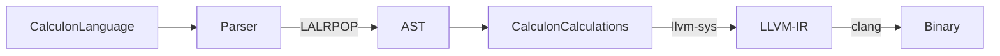

# Calculon

Simple PoC language using LALRPOP and llvm-sys for my own learning (and anyone who is starting out with these tools) around LALRPOP and LLVM:
- To parse a grammar, which in this case is a simple one line arithmetic i.e `((5*5) + 2)` using [LALRPOP](https://crates.io/crates/lalrpop) taken from this [tutorial](http://lalrpop.github.io/lalrpop/tutorial/004_full_expressions.html)
- To then compile that to LLVM IR with [llvm-sys](https://crates.io/crates/llvm-sys)
- To generate that from LLVM IR to a native executable using clang 



Going to extend this as a seperate language to include a more complex grammar. Keep this here with the simple language as it demonstrates high level what architecture is needed for a language that uses LLVM as the backend. 

## Run

Currently set up for arm64 (m1 Mac) with LLVM (13), [just change this line in the code to the required architecture](https://github.com/lyledean1/calculon/blob/main/src/main.rs#L97)

Install LLVM 13
```
brew install llvm@13
```

Set LLVM_SYS_130_PREFIX variable before you run `cargo run`
```
export LLVM_SYS_130_PREFIX=/PATH/TO/LLVM13/VERSION
```

Some examples are in the example folder, just run 
```
cargo run example/calculator.calculon
```


